# Airbnb Clone <!-- omit in toc -->

> An iOS app replicating Airbnb's UI and functionality. Explore property listings, book accommodations, and view user profiles

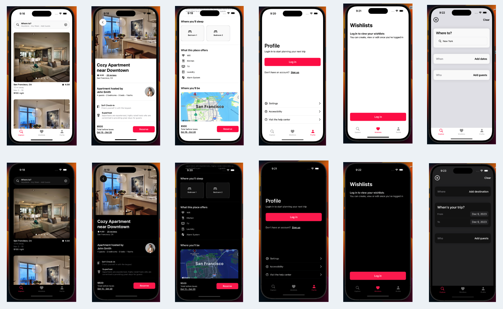

## Demo

## Table of Contents

- [Overview](#overview)
- [Features](#features)
- [Screenshots](#screenshots)
  - [Light Mode](#light-mode)
  - [Dark Mode](#dark-mode)
- [Technologies Used](#technologies-used)
- [Getting Started](#getting-started)

## Overview

This repository contains a mobile app built with SwiftUI, replicating the Airbnb user interface and functionality. The project serves as a demonstration of iOS app development skills, showcasing modern design patterns and best practices using Swift and SwiftUI.

## Features

- **Property Listings:** Explore a wide range of property listings with detailed information.
- **Dark Mode:** The app is fully dark mode compliant
- **Interactive Map:** View property locations on an interactive map using MapKit integration.
- **Booking System:** Seamless booking experience with date selection and reservation confirmation.

## Screenshots

### Light Mode

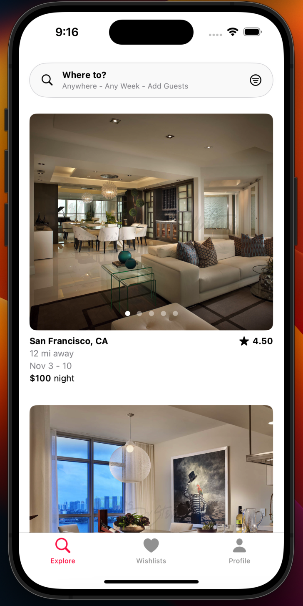

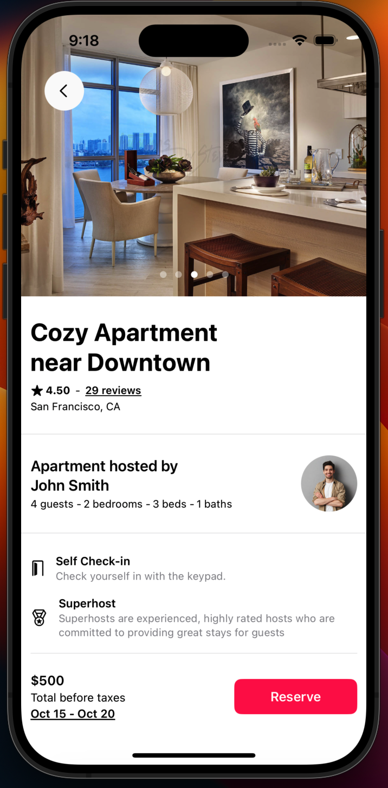

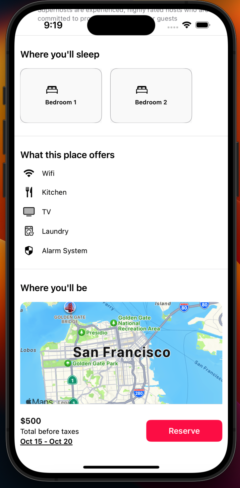

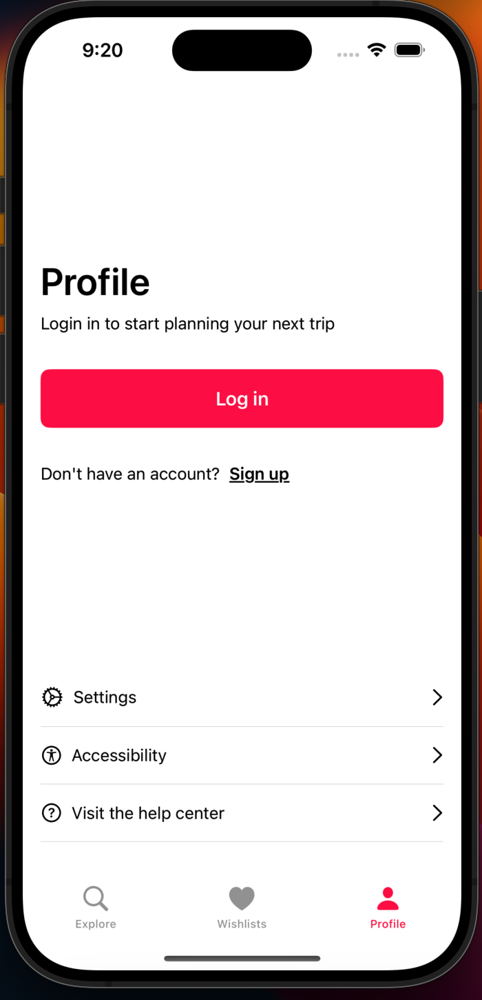

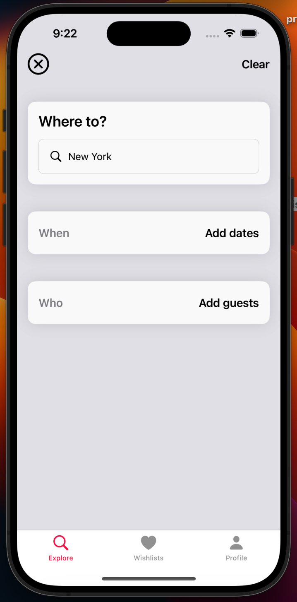

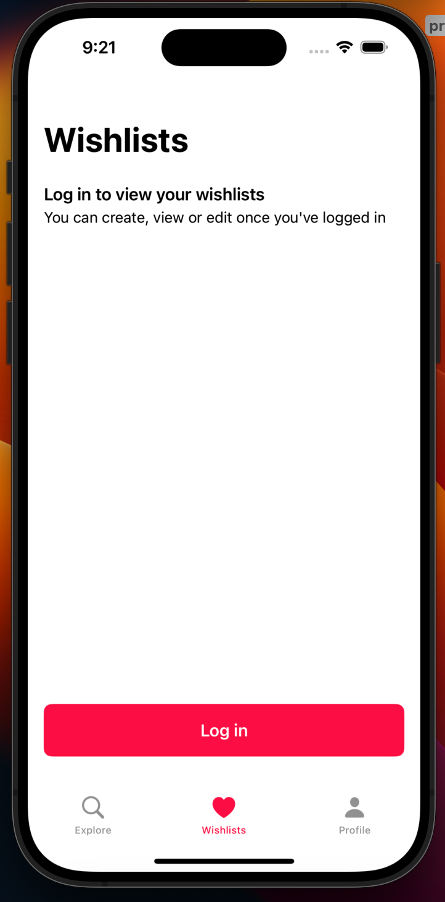

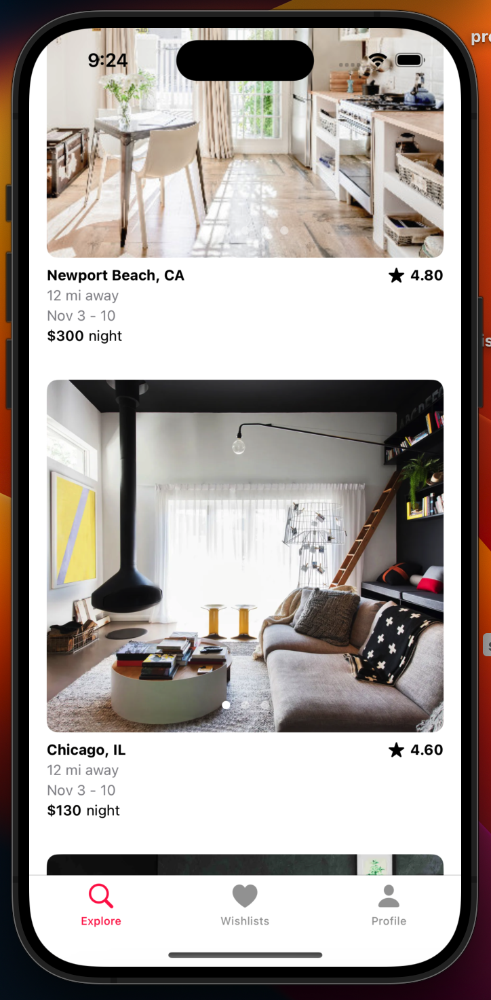

### Dark Mode

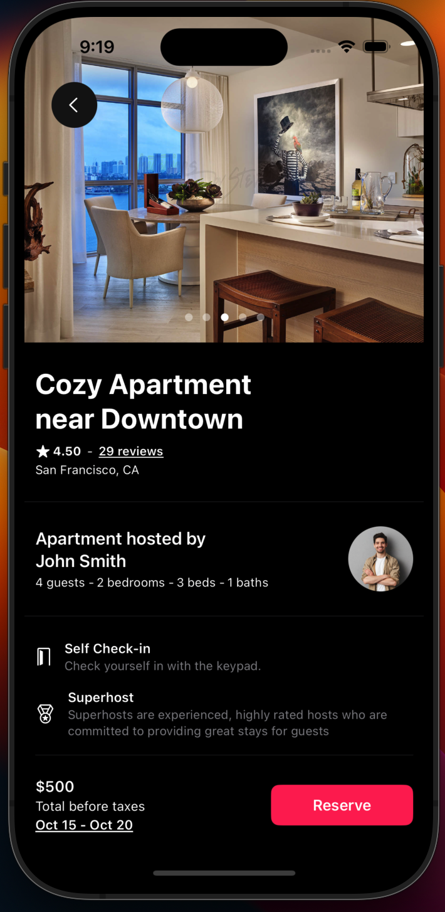

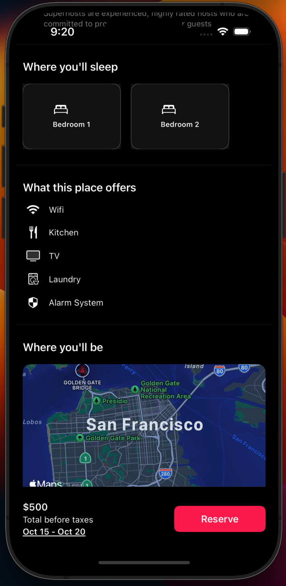

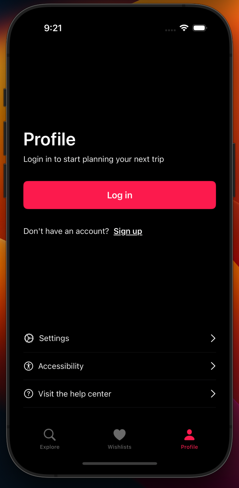

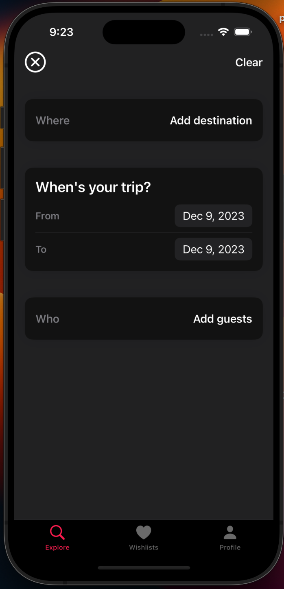

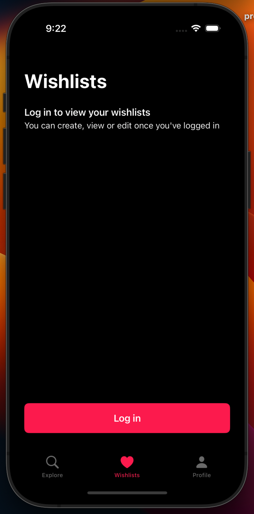

## Technologies Used

- **SwiftUI:** Modern declarative UI framework for building the app's user interface.
- (TBA) **Combine Framework:** Utilized for handling asynchronous operations and data flow.
- (TBA) **MapKit:** Integrated for displaying property locations on the map.
- (DROPPED) **Core Data:** Local storage for caching property data and user information.

## Getting Started

1. Clone the repository: `git clone https://github.com/sebastian-nunez/airbnb-ios.git`
2. Open the project in Xcode.
3. Build and run the app on your iOS simulator or physical device.

Feel free to contribute, report issues, or use this project as a reference for your SwiftUI and iOS app development!
